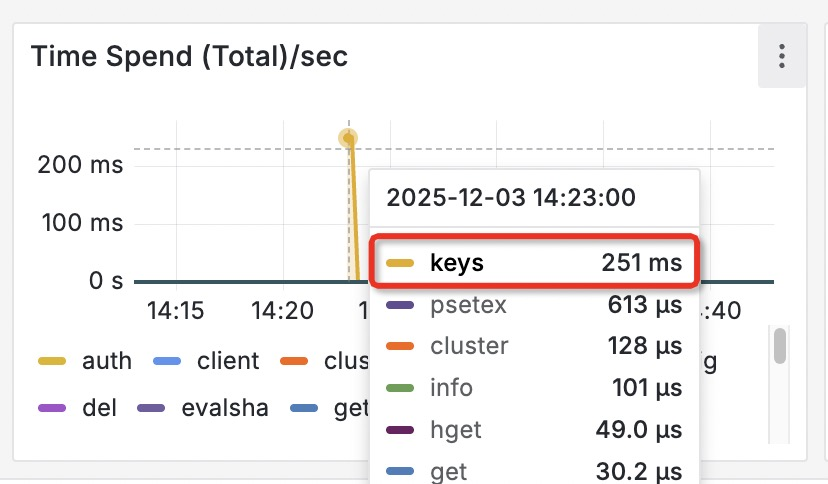

# Redis中KEYS命令的潜在风险与遍历建议


> 本文通过一次 Redis 执行 KEYS 命令引发的生产环境故障， 讨论了相应的风险与替代方案。 官方强烈建议仅将KEYS用于调试，常规应用应改用SCAN命令或SSCAN命令来安全遍历key。


## 生产环境事故背景


最近我们的生产环境中, 因为有人在运维界面中使用了 `KEYS` 命令, 导致了一些问题。

> 背景: 运维平台中, 禁止了 `KEYS *` 命令的执行, 但是没有拦截 `KEYS somePrefix:*` 这种带前缀模式的匹配, 也没有拦截 `KEYS somePrefix:someKey` 这种方式, 所以导致了故障。





单次命令影响的时间大约是 `251ms`, 但因为我们的系统属于高并发实时系统, 所以影响了几千次的系统请求, 并且因为排查故障原因, 消耗了团队很多时间。


> 后续: 运维平台直接禁止了 `KEYS` 命令.


## `KEYS` 命令说明

`KEYS` 命令曾经用来匹配Redis中的所有key.

`KEYS` 命令的官方文档为:

> https://redis.io/docs/latest/commands/keys/


其中说到:

> Time complexity:
> `O(N)` with `N` being the number of keys in the database, under the assumption that the key names in the database and the given pattern have limited length.

简单翻译:

> 时间复杂度: `O(N)`
> 其中 `N` 是Redis节点对应的数据库中 key 的总数量, 假设数据库中的 key 长度, 以及需要匹配模式的长度， 都在一定长度范围以。

总结一下: 

> 如果Redis数据库中的KEY数量很多的话, 那么执行 `KEYS` 命令会阻塞整个库很长时间。 

这个阻塞的过程, 对于数据库而言就类似于假死一段时间, 其他所有的请求可能都会超时。


继续看后面,  官方文档说的比较好听: 


```

While the time complexity for this operation is O(N), the constant times are fairly low. For example, Redis running on an entry level laptop can scan a 1 million key database in 40 milliseconds.

Warning: consider KEYS as a command that should only be used in production environments with extreme care. It may ruin performance when it is executed against large databases. This command is intended for debugging and special operations, such as changing your keyspace layout. Don't use KEYS in your regular application code. If you're looking for a way to find keys in a subset of your keyspace, consider using SCAN or sets.
```

> 虽然时间复杂度是 `O(N)`, 但是常态时间非常低. 例如, 在一台入门级别的笔记本电脑上, Redis 扫描100万个key的数据库, 只需要花费 40ms 的时间。

> 警告: 在生产环境中使用 `KEYS` 命令需要十分小心。 如果数据库比较大, 可能会伤害系统性能。 该命令是用于调试或者特殊操作, 比如修改 key 空间的分布等。 在程序代码中严禁使用  `KEYS` 命令, 需要使用  `SCAN` 或者 `set` 相关的扫描命令。

